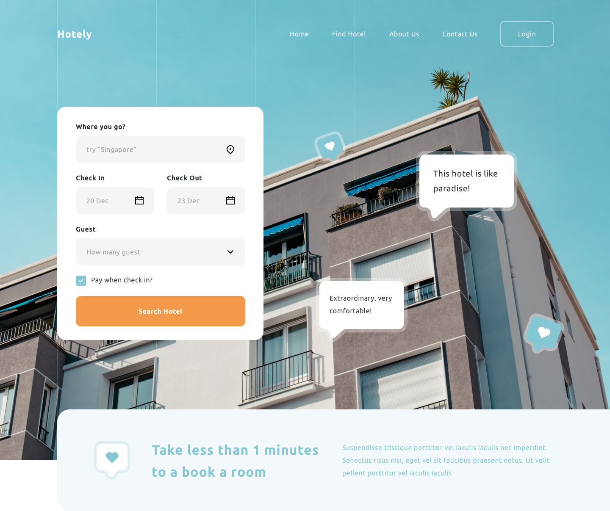

# Static Website Recruitment Task

Hi!

Thank you for joining our recruitment process @ Clean Commit! This task will test how you can work with static websites.

## Task

We have to create a static landing page for Hotely. Can you ship it?

The design can be found in sources library in .sketch, .fig and .xd. Our designers work mostly with Figma, but you can choose whichever you like!

## Rules & Hints

1. Use Gatsby with our [starter](https://github.com/clean-commit/gatsby-starter)
2. Use Tailwind as your framework
3. Use Netlify to deploy the website (don't worry, it's free!)
4. Styles should be written in Sass (SCSS).
5. Pay attention to code quality, formatting, conventions etc. (Your code is your business card)
6. Adding content to Netlify CMS is a plus!
7. Try to optimize images :)
8. Send us the link to the site and access to your repo to check out your work!
